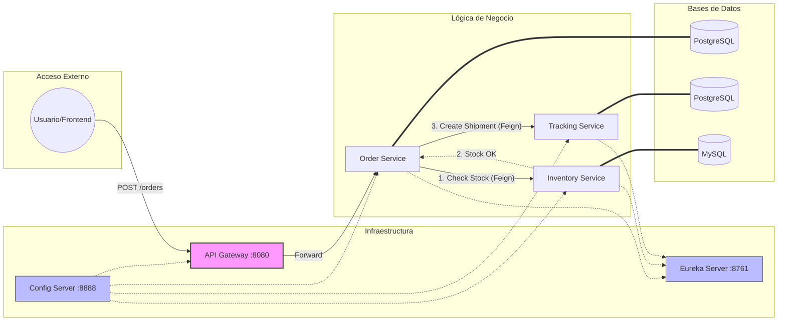

# Especificación Técnica: StreamLine Logistics

## 1. Resumen del Sistema

El sistema gestiona el ciclo de vida de un pedido desde su creación hasta su entrega final, asegurando que el stock sea consistente y que el cliente pueda seguir su paquete en tiempo real.

## 2. Definición de Microservicios

### A. Order Service (Gestor de Pedidos)

**Responsabilidad**: Punto de entrada para nuevas compras. Valida datos del cliente y crea el registro inicial del pedido.

**Base de Datos**: PostgreSQL. (Elegida por su robustez para transacciones ACID y relaciones complejas entre clientes y líneas de pedido).

Estado inicial: PENDING_CHECK.

### B. Inventory Service (Gestor de Stock)

**Responsabilidad**: Controlar las existencias de productos en los almacenes.

**Base de Datos**: MySQL. (Excelente rendimiento en operaciones de lectura/escritura de tablas maestras de productos).

**Lógica Clave**: Debe permitir el "bloqueo" de stock antes de confirmar la venta definitiva.

### C. Tracking Service (Gestor de Seguimiento)

**Responsabilidad**: Registrar cada "salto" del paquete (Salida de almacén, en tránsito, entregado).

**Base de Datos**: PostgreSQL. (Ideal para auditoría y series temporales de estados).

**Lógica Clave**: Genera el número de seguimiento único (UUID).

## 3. Infraestructura y Comunicación

## Componentes de Soporte

**Config Server**: Puerto ```8888```. Almacena archivos YAML de configuración.

**Eureka Server**: Puerto ```8761```. Registro y descubrimiento de servicios.

**API Gateway**: Puerto ```8080```. Único punto de acceso externo. Implementará seguridad y enrutamiento.

Comunicación Inicial (Fase 1: Síncrona)
En esta primera etapa, utilizaremos OpenFeign para la comunicación entre servicios:

Order Service recibe petición HTTP POST.

Order Service llama a ```Inventory Service``` vía Feign para validar/reservar stock.

Si el stock existe, ```Order Service``` llama a ```Tracking Service``` para inicializar el seguimiento.

Se responde al cliente con el ID del pedido.

## 4. Decisiones Técnicas

¿Por qué Monorepo? Facilita la gestión de dependencias compartidas (como una librería de DTOs comunes si fuera necesario) y simplifica el despliegue con un único ```docker-compose```.

¿Por qué base de datos por servicio? Para evitar el "acoplamiento por base de datos". Si el ```Inventory Service``` necesita escalar o cambiar su esquema, no afecta al ```Order Service```.

¿Por qué ```Docker-Compose```? Para garantizar que el entorno de desarrollo sea idéntico al de producción, orquestando las 3 bases de datos y los microservicios con un solo comando.

## 5. Modelado de Datos

### A. Order Service (PostgreSQL)

- Entidad ```Order```
  - ```id```: Long (Primary Key)
  - ```orderNumber```: String (UUID para seguimiento público)
  - ```customerId```: Long (ID del usuario que compra)
  - ```orderDate```: LocalDateTime
  - ```status```: Enum (PENDING_CHECK, CONFIRMED, SHIPPED, CANCELLED)
  - ```totalPrice```: BigDecimal

- Entidad ```OrderItem``` (Relación OneToMany)
  - ```id```: Long
  - ```productId```: Long (Referencia al producto en el inventario)
  - ```quantity```: Integer
  - ```priceAtPurchase```: BigDecimal (Importante guardar el precio del momento, no el actual)

### B. Inventory Service (MySQL)

- Entidad ```Product```
  - ```id```: Long (Primary Key)
  - ```sku```: String (Código único de almacén, ej: "TSHIRT-BLUE-L")
  - ```name```: String
  - ```description```: String
  - ```price```: BigDecimal

- Entidad ```Stock``` (Relación OneToOne con Product)
  - ```id```: Long
  - ```productId```: Long
  - ```quantity```: Integer (Cantidad disponible actual)
  - ```reservedQuantity```: Integer (Para pedidos en proceso pero no enviados aún)

## C. Tracking Service (PostgreSQL)

- Entidad ```Shipment```
  - ```id```: Long (Primary Key)
  - ```orderId```: Long (Referencia al ID del Order Service)
  - ```trackingNumber```: String (El código que se le da al cliente)
  - ```carrier```: String (Ej: "DHL", "FedEx")
  - ```estimatedDelivery```: LocalDateTime

- Entidad ```TrackingEvent``` (Relación OneToMany)
  - ```id```: Long
  - ```shipmentId```: Long
  - ```status```: String (Ej: "Recogido en almacén", "En aduanas", "Reparto local")
  - ```location```: String (Ciudad/Coordenadas)
  - ```timestamp```: LocalDateTime

## 5. Comunicación entre servicios (Contratos DTO)

Para que estos servicios hablen entre sí mediante OpenFeign, necesitarás objetos intermedios (DTOs).

```InventoryRequest```: El ```Order Service``` envía al ```Inventory Service``` una lista de {productId, quantity}.

```InventoryResponse```: El ```Inventory Service``` responde con un boolean success y, si falla, el motivo.

```TrackingRequest```: El ```Order Service``` envía al ```Tracking Service``` los datos del cliente y el ID del pedido para generar el envío.


