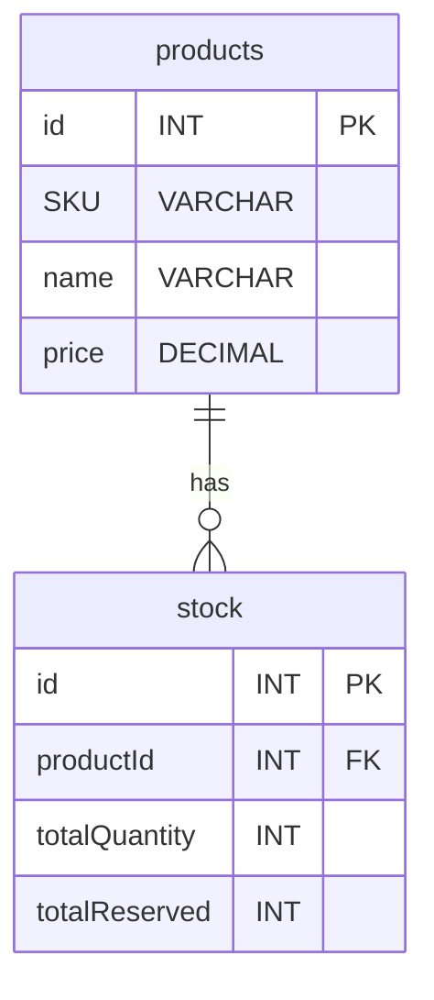

# Inventory Service

## Responsabilidad

Este servicio se encarga de gestionar el inventario de productos, asegurando que las cantidades disponibles se actualicen correctamente durante el proceso de venta. Además, implementa un mecanismo de bloqueo de stock para garantizar que los productos no se vendan a múltiples clientes simultáneamente, evitando así problemas de sobreventa.

Utiliza una base de datos MySQL para almacenar la información de los productos y sus cantidades disponibles, lo que permite un rendimiento eficiente en las operaciones de lectura y escritura necesarias para mantener el inventario actualizado.

## Modelado de Datos

El modelo de datos para el servicio de inventario incluye una tabla principal llamada `products`, que contiene los siguientes campos:

- `id`: Identificador único del producto (clave primaria)
- `SKU`: Código de referencia del producto.
- `name`: Nombre del producto.
- `price`: Precio del producto.

También se incluye una tabla de `stock` para gestionar las cantidades disponibles de cada producto, con los siguientes campos:

- `id`: Identificador único del stock (clave primaria)
- `productId`: Referencia al producto (clave foránea)
- `totalQuantity`: Cantidad disponible del producto.
- `totalReserved`: Cantidad reservada del producto (bloqueada para ventas en proceso).

Esquema de la base de datos:

## Endpoints
