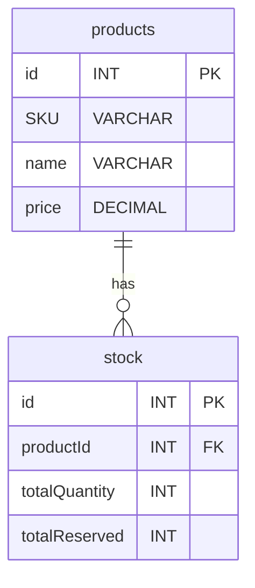

# Inventory Service

## Responsabilidad

Este servicio se encarga de gestionar el inventario de productos, asegurando que las cantidades disponibles se actualicen correctamente durante el proceso de venta. Además, implementa un mecanismo de bloqueo de stock para garantizar que los productos no se vendan a múltiples clientes simultáneamente, evitando así problemas de sobreventa.

Utiliza una base de datos MySQL para almacenar la información de los productos y sus cantidades disponibles, lo que permite un rendimiento eficiente en las operaciones de lectura y escritura necesarias para mantener el inventario actualizado.

## Modelado de Datos

El modelo de datos para el servicio de inventario incluye una tabla principal llamada `products`, que contiene los siguientes campos:

- `id`: Identificador único del producto (clave primaria)
- `SKU`: Código de referencia del producto.
- `name`: Nombre del producto.
- `price`: Precio del producto.

También se incluye una tabla de `stock` para gestionar las cantidades disponibles de cada producto, con los siguientes campos:

- `id`: Identificador único del stock (clave primaria)
- `productId`: Referencia al producto (clave foránea)
- `totalQuantity`: Cantidad disponible del producto.
- `totalReserved`: Cantidad reservada del producto (bloqueada para ventas en proceso).

Esquema de la base de datos:

```mermaid
erDiagram
    products {
        id INT PK
        SKU VARCHAR
        name VARCHAR
        price DECIMAL
    }
    stock {
        id INT PK
        productId INT FK
        totalQuantity INT
        totalReserved INT
    }
    products ||--o{ stock : has
```

## Endpoints

Url base local: `http://localhost:9090/api/v1/inventory`

- `GET /`: Obtener la lista de productos.
- `GET /{id}`: Obtener información de un producto específico.
- `POST /`: Crear un nuevo producto.
- `POST /{id}/addStock`: Añadir una cantidad de stock a un producto existente.
- `POST /{id}/reserveStock`: Reservar una cantidad de un producto para una orden en proceso.
- `POST /{id}/releaseStock`: Liberar una cantidad de un producto reservada previamente, en caso de que la orden sea cancelada o no se confirme la venta.
- `POST /{id}/consumeStock`: Confirmar la venta de una cantidad de un producto, reduciendo el stock disponible y liberando la cantidad reservada.

## Aclaraciones

Las entidades `Product`y `Stock` no estan unidas por una relación directa con la anotación `@OneToOne` para evitar problemas de rendimiento y complejidad en las consultas. En su lugar, se utiliza el campo `productId` en la entidad `Stock` para establecer una relación lógica entre ambas entidades, lo que permite una gestión más eficiente del inventario sin necesidad de cargar toda la información del producto cada vez que se accede al stock. Además, esto facilita la creación de mappers personalizados para convertir entre las entidades de dominio y las entidades de persistencia, lo que mejora la flexibilidad y el rendimiento del sistema.
