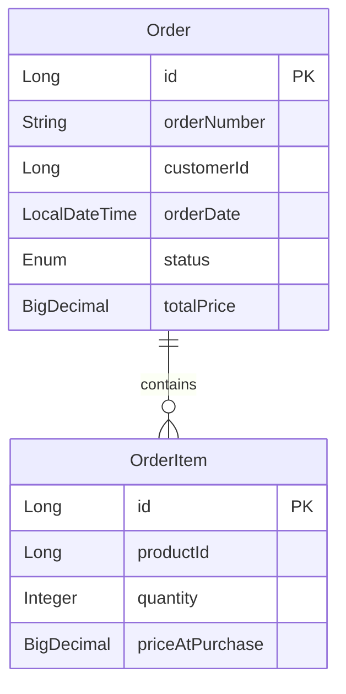

# Order Service

## Responsabilidad

Este servicio se encarga de gestionar el proceso de creación y seguimiento de órdenes de compra, asegurando que las transacciones se realicen de manera segura y eficiente. Implementa lógica para validar la disponibilidad de productos, calcular totales y gestionar el estado de las órdenes a lo largo del proceso.

Utiliza una base de datos PostgreSQL para almacenar la información de las órdenes y sus detalles, lo que permite un rendimiento eficiente en las operaciones de lectura y escritura necesarias para mantener el sistema actualizado.

## Modelado de Datos

El modelo de datos para el servicio de inventario incluye una tabla principal llamada `Order`, que contiene los siguientes campos:

- ```id```: Long (Primary Key)
- ```orderNumber```: String (UUID para seguimiento público)
- ```customerId```: Long (ID del usuario que compra)
- ```orderDate```: LocalDateTime
- ```status```: Enum (PENDING_CHECK, CONFIRMED, SHIPPED, CANCELLED)
- ```totalPrice```: BigDecimal

También se incluye una tabla de `OrderItem` para gestionar las cantidades disponibles de cada producto con relacion 1:N con `Order`, con los siguientes campos:

- ```id```: Long
- ```productId```: Long (Referencia al producto en el inventario)
- ```quantity```: Integer
- ```priceAtPurchase```: BigDecimal (Importante guardar el precio del momento, no el actual)

Esquema de la base de datos:



## Endpoints

## Aclaraciones
